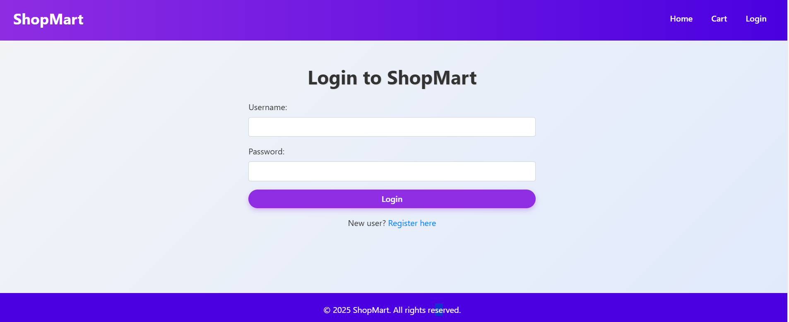
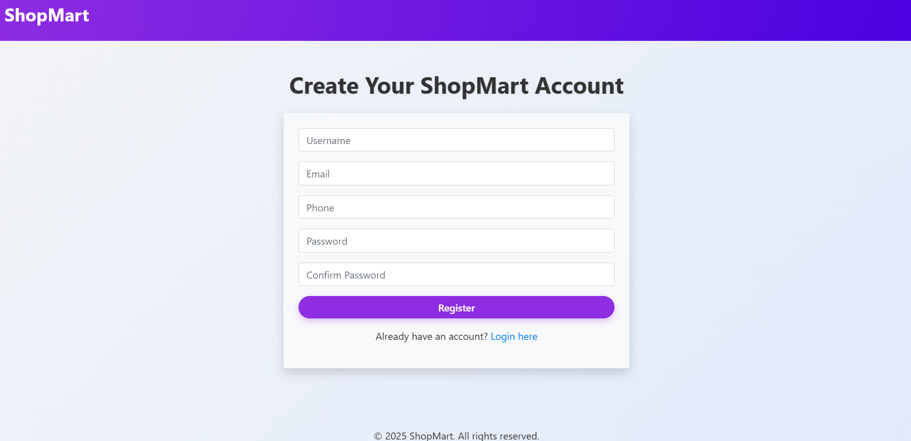
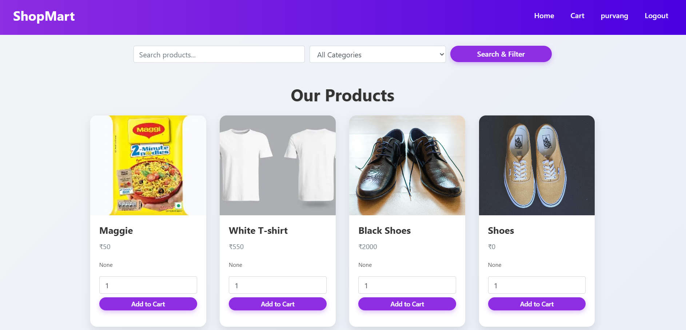
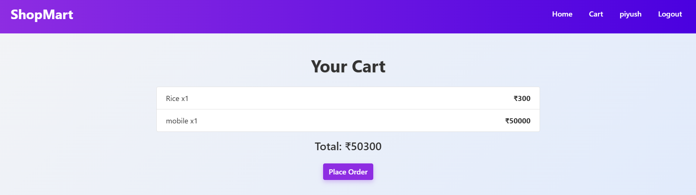
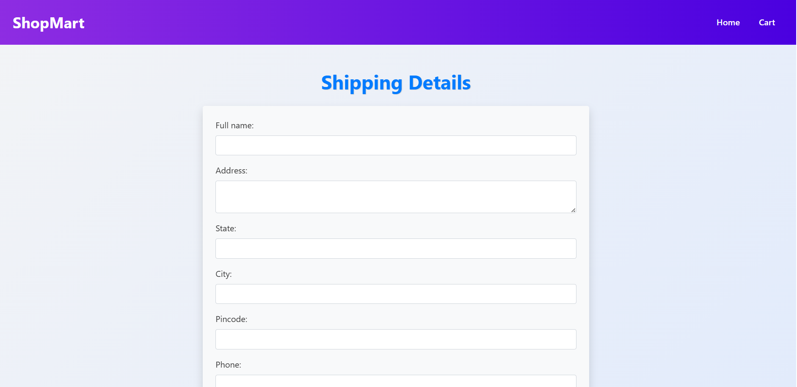
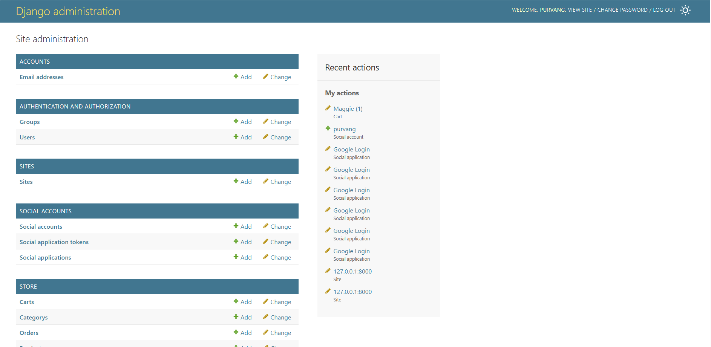
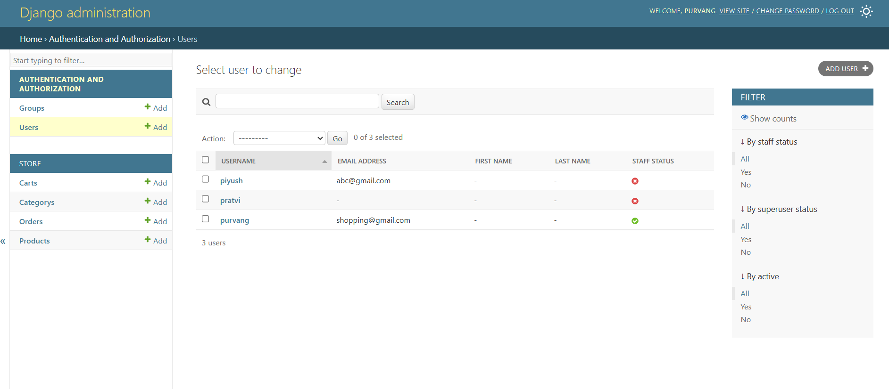

# 🛍️ ShopMart - Django E-commerce Website

ShopMart is a modern and responsive e-commerce web application built with **Django**, **HTML**, **CSS**, and **Bootstrap 4**. It allows users to register, log in, view products, add them to cart, and place orders with shipping details. Admin can manage products, categories, and orders via the Django admin panel.

---

## 🌟 Features

- ✅ User Registration & Login (with password confirmation)
- ✅ Add to Cart Functionality
- ✅ Place Order with Total Calculation
- ✅ Shipping Details Form
- ✅ OTP Verification Simulation (optional)
- ✅ Admin Panel for managing Users, Products, Categories, Orders
- ✅ Responsive & Colorful UI using Bootstrap 4 and Custom CSS
- ✅ Logged-in User's Name displayed in navbar

---

## 🛠️ Tech Stack

- **Backend**: Django (Python)
- **Frontend**: HTML5, CSS3, Bootstrap 4
- **Database**: SQLite (default with Django)
- **Admin Panel**: Django Admin
- **Authentication**: Django’s built-in auth system

---

## 📸 Screenshots

### 🔐 Login Page


---

### 📝 Register Page


---

### 🛒 Product Listing Page


---

### 🧾 Cart Page


---

### 🚚 Shipping Details Form


---

### ⚙️ Admin Panel - Dashboard


---

### 👥 Admin Panel - User List


---

## 🧑‍💻 How to Run This Project

### 1. Clone the Repository

```bash
git clone https://github.com/your-username/shopmart.git
cd shopmart
```

### 2. Create Virtual Environment

```bash
python -m venv env
```

Activate it:
- Windows:
  ```bash
  env\Scripts\activate
  ```
- Linux/macOS:
  ```bash
  source env/bin/activate
  ```

### 3. Install Dependencies

```bash
pip install -r requirements.txt
```

### 4. Run Migrations

```bash
python manage.py makemigrations
python manage.py migrate
```

### 5. Create Superuser (Admin)

```bash
python manage.py createsuperuser
```

### 6. Run the Development Server

```bash
python manage.py runserver
```

Open `http://127.0.0.1:8000` in your browser to view the app.

---

## 🔑 Default Admin Features

- Manage: Products, Orders, Cart, Categories, Users
- View all orders and shipping information
- Secure login/logout functionality

---

## 📂 Folder Structure

```
shopmart/
├── store/                  # Main Django app (models, views, templates)
├── static/                 # Static files (CSS, images)
├── templates/              # HTML templates
├── db.sqlite3              # SQLite database
├── manage.py
└── requirements.txt
```

---

## 🙋‍♂️ Author

**Purvang Dave**  
📧 [shopping@gmail.com](mailto:shopping@gmail.com)

---

## 📄 License

This project is licensed under the MIT License.

---

## 📢 Note

All screenshots used in this README are located in the `screenshots/` folder. Make sure you upload all provided PNG images to that directory in your GitHub repo and rename accordingly:

| Screenshot               | Filename to Save As              |
|--------------------------|----------------------------------|
| Login Page               | `screenshots/login.png`          |
| Register Page            | `screenshots/register.png`       |
| Product Page             | `screenshots/products.png`       |
| Cart Page                | `screenshots/cart.png`           |
| Shipping Page            | `screenshots/shipping.png`       |
| Admin Dashboard          | `screenshots/admin_dashboard.png`|
| Admin Users              | `screenshots/admin_users.png`    |

---

✅ **Simple, colorful, and fully functional – ShopMart makes Django e-commerce development easy and beautiful!**
